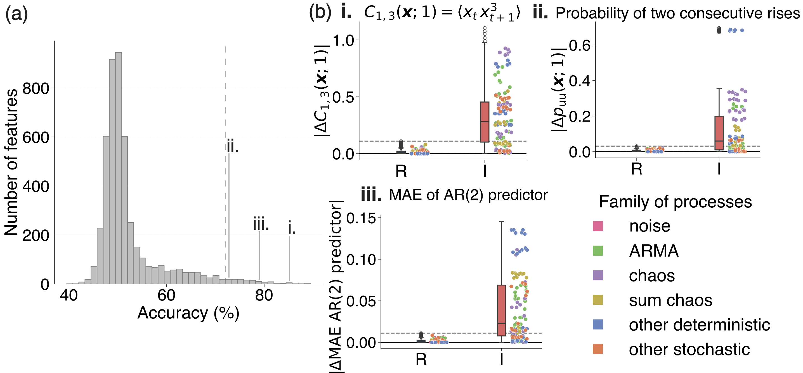
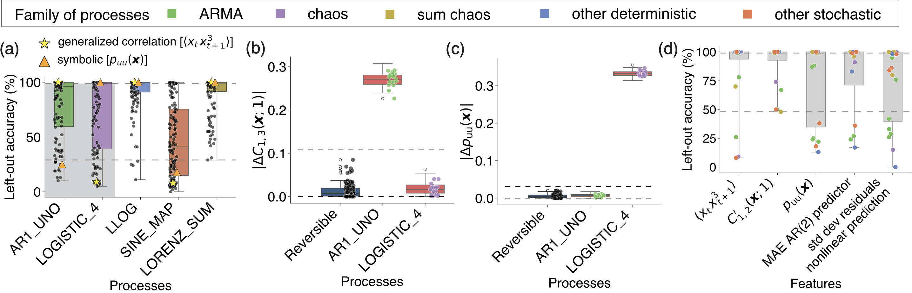
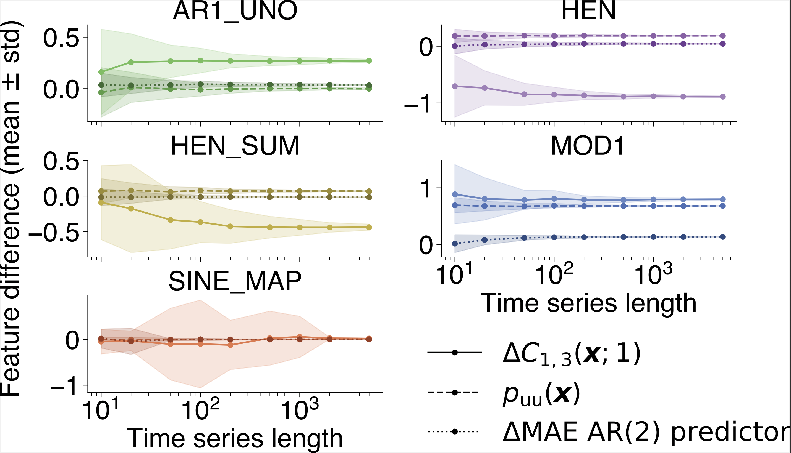

# A data-driven approach to identifying statistical indicators of temporal asymmetry
This repository contains all code needed to reproduce analyses presented in our preprint "**A data-driven approach to identifying statistical indicators of temporal asymmetry**". 
Time series and pre-processesd data are openly available (**zenodo**).
The repository also contains code for generating data and running the analysis from scratch.

# Installation

Python dependencies for this repository are managed via [uv](https://docs.astral.sh/uv/). To install uv on Mac/Linux, run the following command in your terminal:

    curl -LsSf https://astral.sh/uv/install.sh | sh

You may also want to install shell autocompletion for ease of use, which you can do by running

    echo 'eval "$(uv generate-shell-completion bash)"' >> ~/.bash_profile
    echo 'eval "$(uvx --generate-shell-completion bash)"' >> ~/.bash_profile

after installing uv (if you're on linux and you have a `.bashrc` instead of a `.bash_profile`, change the above accordingly).

Alternatively, you can install uv via brew

    brew install uv

To install this repository and its dependencies, run the following in a terminal:
    
    git clone git@github.com:teresa-dn/Time-reversibility.git
    cd Time-reversibility
    uv sync

# Usage
## 1. Using supplied pre-processed data to reproduce results
### Data availability
Data used in "A data-driven approach to identifying statistical indicators of temporal asymmetry" is available at **zenodo**. To run the analysis, drag the `data-tr.zip` file into the repo and unzip there, leaving the uncompressed `data-tr` folder in the repo. You should now have the foler `Time-reversibility/data-tr` in your path.

#### Pre-processed data
The folder `data-tr/main-analysis/data-analysis/` contains:
- `df_TS_DataMat_diff.csv`: pre-processed dataset of feature differences, $\Delta f_i = f_i -\tilde{f_i}$, $i\in\{1,...,6082\}$ where $f_i$ is the $i$-th feature computed from the forward time series and $\tilde f_i$ is the $$-th feature computed from the reversed time series;
- `common_ops.csv`: set of features after pre-processing;

#### Time series
Time series of the simulated discrete-time and continuous-time processes are stored in `data-tr/main-analysis/time-series/data-dsct` and `data-tr/main-analysis/time-series/data-cnt`, respectively. Each folder named after a process contains 100 realizations 5000-samples long forward in time (files named `[process_label]_[idx_ts].txt`) and the respective 100 realizations flipped in time (`[process_label]_reverse_[idx_ts].txt`).

#### _hctsa_ matrices
Matrices obtained from the _hctsa_ analysis of the time series above are contained in `data-tr/main-analysis/hctsa/hctsa-dsct` and `data-tr/main-analysis/hctsa/hctsa-cnt`, respectively. Each folder contains:

- `HCTSA_frwd.mat` file resulting from the _hctsa_ analysis of forward time series;
- `HCTSA_bkwd.mat` file resulting from the _hctsa_ analysis of reversed time series;

### Analysis 
Code for the analysis of the feature difference dataset `df_TS_DataMat_diff.csv` is in the [src/main/python](/src/main/python/) folder of the repository.

#### Time-reversal invariant features
Run the notebook [1-zero_features.ipynb](src/main/python/1-zero_features.ipynb) to reproduce the visualization of the robustness of a subset of top-performing features across processes.

#### Statistics for reversibility
The notebook [2-1NN_classification.ipynb](src/main/python/2-1NN_classification.ipynb) assigns the accuracy of classification between the reversible and irreversible groups to each feature $f_i$. We used the performance of a 1-nearest neighbor (1-NN) classifier in the space of each $f_i$, evaluated using a leave-one-process-out cross-validation strategy.

The notebook [3-feature_selection.ipynb](src/main/python/3-feature_selection.ipynb) extracts the set of top-performing features, characterized by an accuracy greater than a given threshold. We chose 72% to encompass a sufficiently large set of features for analysis. Distributions of $|\Delta f_i|$ can be reproduced using the notebook [4-boxes.ipynb](src/main/python/4-boxes.ipynb).

  

#### Statistical signatures of irreversibility are process-dependent
The notebook [5-min_max.ipynb](src/main/python/5-min_max.ipynb) analyses the strength and weaknesses of diverse top-performing features in detecting the reversibility of specific simulated processes computing the accuracy of classification per process (referred to as "left-out accuracy"). The notebook can be used to reproduce figures (a) and (d) below while distributions of $|\Delta f|$ in (b) and (c) can be reproduced using the notebook [4-boxes.ipynb](src/main/python/4-boxes.ipynb).

  

#### Additional visualizations
The notebook [6-inspect_good_features.ipynb](src/main/python/6-inspect_good_features.ipynb) contains a hierarchical clustering analysis to identify similarities across features.

The notebook [7-plot_distributions.ipynb](src/main/python/7-plot_distributions.ipynb) contains an alternative plot of the distribution of $|\Delta f|$ per process.

### Robustness analysis
Code for the analysis of the feature difference obtained from time series with diverse length in [robustness/python](src//robustness/python/).

  

## 2. From scratch
### Data generation
If you want to run the code from scratch, generating your own time series and analysing them through _hctsa_ you should start by making the `data-tr` directory. 

    cd Time-reversibility
    mkdir data-tr

To run the python code which generates most of the data files, run the following:

    uv run src/main/data-generation/discrete-time/discrete_data_generation.py
    uv run src/main/data-generation/continuous-time/continuous_data_generation.py

The coloured noise processes were simulated using the [MATLAB package](https://au.mathworks.com/matlabcentral/fileexchange/42919-pink-red-blue-and-violet-noise-generation-with-matlab). The code we used is stored in the [noise_generation](src/main/data-generation/noise_generation/) directory. 
To generate the data, run the [noise_generator.m](src/main/data-generation/noise_generation/noise_generator.m) script.

### _hctsa_ analysis
To run the analysis you need to have [_hctsa_](https://github.com/benfulcher/hctsa) installed.

#### Step 1: prepare input files in the [run](src/main/analysis-hctsa/run/) folder 
**Set-up time series**: to create input files `INP_ts_[dsct/cnt]_[frwd/bkwd].txt` with the path of time series for the _hctsa_ run, run the following:

    uv run src/main/analysis-hctsa/run/INP_file_generation_dsct.py
    uv run src/main/analysis-hctsa/run/INP_file_generation_cnt.py

**Set-up features**: input files with operations [INP_ops.txt](src/main/analysis-hctsa/run/INP_ops.txt) and [INP_mops.txt](src/main/analysis-hctsa/run/INP_mops.txt) for the _hctsa_ run.

#### Step 2: run the _hctsa_ analysis
Run the _hctsa_ analysis following the instructions in the comprehensive [documentation](https://time-series-features.gitbook.io/hctsa-manual/).

Save the outcomes `HCTSA_frwd.mat` and `HCTSA_bkwd.mat` matrices in a folder `data-tr/main-analysis/hctsa/hctsa-dsct` and `data-tr/main-analysis/hctsa/hctsa-cnt` for discrete-time and continuous-time series data, respectively for the pre-processing.

#### Step 3: pre-processing for feature difference matrix
**Create csv files** (optional): if you want csv files of the results run the script [create_csv.m](src/main/analysis-hctsa/pre-processing/create_csv.m).

**Create matrix of differences**: use the notebook [pre_processing.m](src//main/analysis-hctsa/pre-processing/preprocessing_hctsa.m) to extract the matrix of feature differences from the forward and backward _hctsa_ matrices.
Run it twice from the `pre-processing` folder fixing the parameter:

- `first_run=1`: creates the total matrix of forward and backward results and filters out bad-performing features;

- `first_run=0`: creates the matrix of feature differences, $\Delta f_i= f_i-\tilde f_i$;

#### Step 4: creation of dataset for analysis

To create datasets from the _hctsa_ matrix of feature differences run 

    uv run src/main/python/0-dataframe_generation_dsct.py
    uv run src/main/python/0-dataframe_generation_cnt.py

and then, to combine them in a single dataset and extract the common features between discrete-time and continuous-time processes run:

    uv run src/main/python/0-full_dataframe_generation.py

This generates a Python dataframe that can be subsequently analyzed following the same procedure described above in the **1. Using supplied pre-processed data to reproduce results** section.

### Robustness analysis

Follow the instructions above and use the code provided in the [data_generation](src/main/data-generation/) folder to generate time series with different length, the script [INP_file_generatino_dsct.py](src/robustness/analysis-hctsa/run/INP_file_generation_dsct.py) to generate input files, analyze them through _hctsa_ and the scripts in [pre-processing](src/robustness/analysis-hctsa/pre-processing/) to pre-process the `HCTSA_frwd.mat` and `HCTSA_bkwde.mat` matrices. 

To convert the pre-processed files from MATLAB into python dataframes run

    uv run src/robustness/python/0-dataframe.py

If one of the lengths is the one used for the main analysis, to select a subset of both processes and features to analyse run 

    uv run src/robustness/python/0-selection_dataframe.py

Run the analysis with the notebook [1-analysis_features.ipynb](src/robustness/python/1-analysis_features.ipynb).

### Notes on package management

uv will create a virtual environment `.venv` for you in the root directory of the project after you first run `uv sync`. Make sure to use this virtual environment when running the Jupyter notebooks in this repositroy!

## Contact

Please contact [Teresa Dalle Nogare](mailto:teresa.dallenogare@sydney.edu.au) with any questions.
